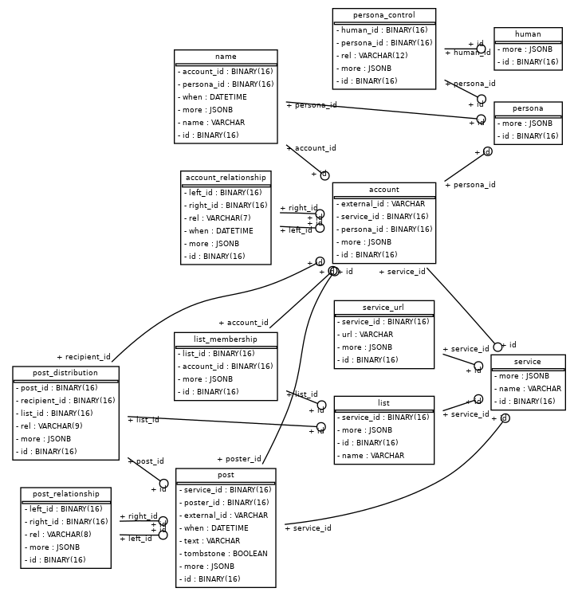

# Skrode
<a href="http://www.imgrum.org/media/978947310038702323_34982965"></a>

Because not everything fits in my endocortex.

## What

**TL;DR** A database that records everything I read, everyone I talk to or interact with, and makes
information such as this searchable to the best of my ability.

This project is inspired by the [Emacs BBDB](https://www.emacswiki.org/emacs/BbdbMode), a tool for
building and maintaining a contacts list by automatically analyzing various sources such as email
and IRC.

I never got BBDB to work for me for a number of reasons...

- I simply don't run long-lived Emacs instances (for long-lived meaning n > 12h)
- BBDB doesn't support Twitter
- I don't use Emacs as my mail client

The goal of this project is to develop a multi-worker queue architecture capable of processing many
source streams from services such as Twitter, IRC, Slack and soforth as well as traditional BBDB
sources such as Atom feeds and email, aggregating user profiles, link data and full text for search.

## Architecture

Skrode is a Postgres backed collection of Python tools written using the SQLAlchemy ORM toolkit,
built via [pants](https://github.com/pantsbuild/pants) and deployed as a
[pex](https://github.com/pantsbuild/pex).

Skrode is primarily concerned with the concepts of Humans, Personas, Services and Accounts. A Human is
a biological entity. Unfortunately, they're rather fluid things about which few assumptions are
actually safe. Humans present Personas to the world - professional or otherwise - which consist of
presences as Accounts on Services.

For instance I have a presence which is the "arrdem" brand. Some people may maintain multiple such
"brands" for various purposes across various services. However none of those presences can really
safely be confused with the person themselves, as the person may self-revise or abandon a persona at
any time.

In keeping with the "big brother" nature of the project, we also warehouse posts made by accounts to
services, recording posts relationships to each-other (reply-to, quotes, etc.) as well as to the
service on which it appears, its distribution (only sent directly to a few Accounts vs anycast etc.)
and other information.

In order to support a multi-process, multi-host worker architecture, Redis is used as a simple
durable-enough job queue primarily for ingesting services such as Twitter which best fit a streaming
rather than batch model.

### SQL Schema



## Project Structure

```
/src       - the source files for all libraries considered to be a part of this project
/scripts   - the various entry points which depend on the source libraries
/vendored  - vendored thirdparty libraries
/3rdparty  - pants style 3rdparty dir for external dependencies
/etc       - various miscellaneous files which are not program sources 
```

## Usage

Skrode consists of three components - the backing databases which are beyond the scope of this
document, the data processing server(s) and the various CLI tools for interacting with stored data.

### The Topology Server

The `scripts/run_topology` program is the crown jewel of this project. It depends on the entirety of
the `src/python/skrode` tree, and presents a generic framework for defining worker processes
connected by work queues and consuming resources.

For example, if we wanted to build a worker topology which connected to the Twitter streaming API,
the configured SQL database and a Redis instance, establishing a small three-worker process topology
for ingesting Twitter posts, as well as home timeline events such as deletes, follows, favorites
replies and soforth we could do so as such

```
# Redis / sql / twitter config. See below for more.

# The queue topology
################################################################################
twitter_user_id_queue:
  &twitter_user_id_queue
  !skrode/queue
  conn: *redis
  key: /queue/twitter/user_ids/ready
  inflight: /queue/twitter/user_ids/inflight

# Tweets can come in by ID
tweet_id_queue:
  &tweet_id_queue
  !skrode/queue
  conn: *redis
  key: /queue/twitter/tweet_ids/ready
  inflight: /queue/twitter/tweet_ids/inflight

# Worker queue topology
################################################################################
twitter_home_timeline:
  type: custom
  target: skrode.ingesters.twitter:user_stream
  # Nominal args
  session: *sql
  twitter_api: *twitter
  user_queue: *twitter_user_id_queue
  # GetUserStream kwargs
  withuser: followings
  stall_warnings: True
  replies: all
  include_keepalive: True

twitter_user_ids:
  type: map
  target: skrode.ingesters.twitter:ingest_user
  source: *twitter_user_id_queue
  session: *sql
  twitter_api: *twitter

twitter_tweet_ids:
  type: map
  target: skrode.ingesters.twitter:ingest_tweet_id
  source: *tweet_id_queue
  session: *sql
  twitter_api: *twitter
  tweet_id_queue: *tweet_id_queue

workers:
  - twitter_home_timeline
  - twitter_user_ids
  - twitter_tweet_ids
```

The `run_topology` program loads up the specified configuration file, and looks at the `"workers"`
key. For each listed worker, it creates a subprocess maintaining a mapping of subprocess PIDs to the
type of worker it represents.

Forked workers load the configuration file for themselves (connections don't tend to travel well
across process boundaries) and select the key named by their worker type.

This example will create three workers - one which consumes the authenticated user's home timeline,
one which consumes users by ID as user IDs are found in the home timeline and one which consumes
tweet IDs as they are found in the timeline. The home timeline worker is a `custom` worker, being it
handles its own looping. The other workers are `map` workers, that is they are simple functions
which need to be mapped over the given source queue.

If a worker encounters an error and exits, the `run_topology` master process will detect the exit
and respawn the failed worker. If the master process receives a SIGINT, it will signal the workers
to gracefully exit and wait for them to do so.

### CLI tools

The `whois.pex` target which relates more to the traditional `finger` command, searches the
configured database for personas with names matching the given pattern, and pretty-prints the
results as mostly-YAML.

```
$ ./pants -q binary scripts/whois
...

$ ./dist/whois.pex "arrdem"
---
persona: f6dde3c9-aed5-4bf0-a2f3-e2411ae143b0
names:
  - @arrdemsays
  - ArrdemSays

accounts:
  - service: <Service 'twitter'>
    foreign key: twitter+user:883521901670178818
    names:
      - @arrdemsays
      - ArrdemSays


---
human: 62cef37c-e9fd-4f18-8f90-6d0500296037
personas:
  - persona: 1ac45ba0-d0f5-484f-8d6b-fa10ac1bd688
    names:
      - arrdem
      - 33e1116b6ef2d7431684ae11c7f91200
      - rdmckenzie
      - @arrdem
      - Reid McKenzie

    accounts:
      - service: <Service 'hackernews'>
        foreign key: hackernews+user:rdmckenzie
        names:
          - rdmckenzie

      - service: <Service 'keybase'>
        foreign key: keybase+user:33e1116b6ef2d7431684ae11c7f91200
        names:
          - 33e1116b6ef2d7431684ae11c7f91200
          - arrdem

      - service: <Service 'lobsters'>
        foreign key: lobsters+user:arrdem
        names:
          - arrdem

      - service: <Service 'github'>
        foreign key: github+user:arrdem
        names:
          - arrdem

      - service: <Service 'twitter'>
        foreign key: twitter+user:389468789
        names:
          - @arrdem
          - Reid McKenzie

      ...
```

The `scripts/twitter/ingest_directs` script connects to the Twitter 1.1 REST API and traverses
the follower / following sets for the authenticated user, inserting user & profile records into the
configured SQL database.

The `scripts/$SERVICE` family of scripts traverse various services, trying to create or populate
Account records. The precise mechanics of the scripts varies, but most are written with respect to
trying to relate Twitter accounts to other services.

## Configuration

Skrode and its affiliated CLI scripts all rely on a config file (by default `./config.yml`, `-c` and
`--config` as CLI options) which provide configuration values for the various required services.

### Example config

```yaml
---
twitter:
  &twitter
  !skrode/twitter
  consumer_key: ...
  consumer_secret: ...
  access_token_key: ...
  access_token_secret: ...
  timeout: 90
  sleep_on_rate_limit: True

sql:
  &sql
  !skrode/sql
  dialect: postgresql+psycopg2
  hostname: ...
  port: ...
  username: ...
  password: ...
  database: bbdb

# The Redis database connections should go to
redis:
  &redis
  !skrode/redis
  host: localhost
  port: 6379
  db: 0
```

The type `skrode.config.Config` "understands" how to load a YAML file containing these `!skrode/`
constructors, and exposes both via map-style `.get()` and via `__getattr__` the various keys in the
loaded configuration file.

## License

Copyright Reid 'arrdem' McKenzie. All rights reserved.
